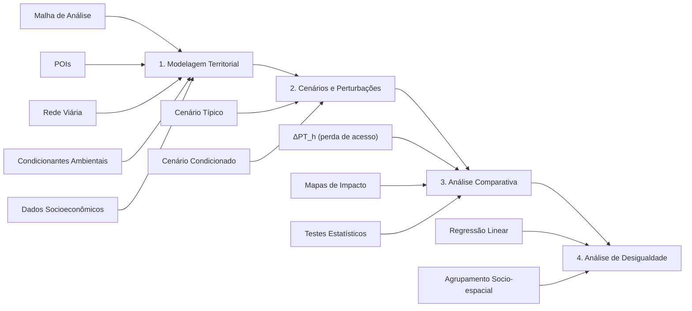

# ambx — Ambient Access

**Framework para avaliação da acessibilidade urbana de curta distância sob perturbações ambientais.**

> Dissertação de Mestrado — Análise multifatorial da acessibilidade a pontos de interesse urbanos, considerando tempos de acesso, morfologia, eventos climáticos atípicos e fatores socioeconômicos.

---

## Visão Geral

O **ambx** (*Ambient Access*) é um framework em Python que modela e analisa como perturbações ambientais e climáticas (inundações, chuvas intensas, escorregamentos) afetam a acessibilidade urbana — e como esses impactos se distribuem desigualmente entre diferentes perfis socioeconômicos da população.

A abordagem metodológica consiste em comparar quantitativamente dois cenários da rede de deslocamento:

1. **Cenário Típico** — condições normais de mobilidade, onde o custo de cada aresta é apenas o comprimento do trecho.
2. **Cenário Condicionado** — a rede tem seus custos penalizados por camadas ambientais (rasters de temperatura, polígonos de alagamento, etc.), simulando a degradação da mobilidade.

A diferença entre os indicadores de acessibilidade nos dois cenários revela **onde**, **quanto** e **para quem** a acessibilidade é perdida.

---

## Estrutura do Projeto

```
dissertacao/
├── docs/
│   └── qualifying/             # Documento de qualificação (LaTeX)
│       ├── main.tex
│       ├── refs.bib
│       ├── figs/
│       └── sections/
│           ├── 1.introduction.tex
│           ├── 2.fundamentals.tex
│           ├── 3.methodology.tex
│           ├── 4.planning.tex
│           ├── 5.results.tex
│           └── apendices.tex
├── scripts/
│   ├── pipeline.py             # Entry point do pipeline completo
│   └── ambx/                   # Biblioteca principal
│       ├── __init__.py
│       ├── grid.py             # Geração de malha territorial
│       ├── pois.py             # Coleta de Pontos de Interesse
│       └── utils.py            # Utilitários geoespaciais
├── notebooks/
│   ├── osmnx_tests.ipynb
│   └── qualifying/
│       ├── generate_simulated_flood_areas.ipynb
│       └── generate_simulated_scenarios.ipynb
└── requirements.txt
```

---

## Fluxo Metodológico



### Etapas

1. **Modelagem Territorial** — O espaço urbano é representado como um sistema discreto com: malha de análise (hexagonal ou quadrada), rede viária como grafo, pontos de interesse categorizados e dados socioeconômicos compatibilizados.
2. **Cenários e Perturbações** — Aplicação de funções de penalização ambiental sobre os custos das arestas. Cálculo de indicadores (PTh, Índice G, F15) para ambos os cenários.
3. **Análise Comparativa** — Quantificação das perdas de acessibilidade (Δ absoluto e relativo), mapeamento espacial dos impactos e validação estatística.
4. **Análise de Desigualdade** — Cruzamento das perdas com dados de renda, escolaridade e densidade populacional via regressão e agrupamento socio-espacial.

### Indicadores

| Indicador | Descrição |
|-----------|-----------|
| **PTh** (*Proximity Time*) | Tempo médio para alcançar os *k* POIs mais próximos de cada categoria, por célula da malha |
| **Índice G** | Coeficiente de Gini da distribuição de acessibilidade entre territórios ou grupos |
| **F15** | Fração da população residente em zonas onde PTh ≤ 15 minutos |

---

## Instalação

```bash
# Clone o repositório
git clone https://github.com/izidoromth/dissertacao.git
cd dissertacao

# Crie e ative o ambiente virtual
python -m venv .venv
source .venv/bin/activate

# Instale as dependências
pip install -r requirements.txt
```

### Dependências principais

- Python ≥ 3.10
- [osmnx](https://github.com/gboeing/osmnx) — acesso ao OpenStreetMap
- [geopandas](https://geopandas.org/) — manipulação de dados geoespaciais
- [shapely](https://shapely.readthedocs.io/) — operações geométricas
- [networkx](https://networkx.org/) — grafos e algoritmos de caminho mínimo
- [pandas](https://pandas.pydata.org/) — manipulação de dados tabulares
- [numpy](https://numpy.org/) — computação numérica

---

## Uso

```python
from ambx.grid import generate_grid, GridFormat
from ambx.pois import get_pois

# Gerar malha hexagonal de 500m para uma cidade
grid = generate_grid("Curitiba, Parana, Brazil",
                     grid_format=GridFormat.HEXAGON,
                     cell_size=500)

# Coletar pontos de interesse
pois = get_pois("Curitiba, Parana, Brazil", buffer=2000)
```

Ou execute o pipeline completo:

```bash
python scripts/pipeline.py
```

---

## Status da Implementação — `ambx`

| Módulo | Status | Descrição |
|--------|:------:|-----------|
| `grid` | ✅ | Geração de malha territorial (hexagonal e quadrada), recorte por contorno administrativo, reprojeção UTM→WGS84 |
| `utils` | ✅ | Determinação do CRS UTM adequado à localização |
| `pois` | ✅ | Coleta e categorização de Pontos de Interesse do OSM (saúde, educação, transporte, alimentação), com buffer para conurbações |
| `network` | ✅ | Construção do grafo viário a partir do OSM, vinculação (snapping) dos centróides da malha à rede |
| `environment` | ❌ | Carregamento de camadas ambientais raster (ex.: temperatura, altimetria) e vetoriais (ex.: manchas de inundação) |
| `demographics` | ❌ | Compatibilização de dados censitários (setores irregulares → células da malha regular) |
| `penalties` | ❌ | Funções de penalização ambiental sobre arestas: sobreposição raster (média de pixels), interseção vetorial, interdição total |
| `routing` | ❌ | Cálculo de caminhos mínimos (Dijkstra / A\*) e matriz origem-destino entre todas as células e POIs |
| `indicators` | ❌ | Cálculo dos indicadores PTh, Índice G (Gini) e F15 para cada cenário |
| `comparison` | ❌ | Análise comparativa entre cenário típico e condicionado (Δ absoluto/relativo, mapas de calor, testes estatísticos) |
| `inequality` | ❌ | Análise de desigualdade socioeconômica (regressão linear, agrupamento socio-espacial) |

**Progresso:** 4 / 11 módulos concluídos (~36%)

### Próximos passos

1. **`environment`** — Leitura de rasters (`rasterio`) e polígonos de inundação simulados.
2. **`routing`** — Matriz OD com `networkx.shortest_path_length` ponderado por distância.
3. **`penalties`** — Função core do framework: `W_cond = f(W_base, C)`, combinando sobreposição raster e interseção vetorial.

---

## Referências

- Bruno, M. et al. (2024). *The 15-minute city for all? – Measuring individual and temporal variations in walking accessibility*. Journal of Transport Geography.
- Hansen, W. G. (1959). *How accessibility shapes land use*. Journal of the American Institute of Planners.
- Geurs, K. T. & van Wee, B. (2004). *Accessibility evaluation of land-use and transport strategies*. Journal of Transport Geography.
- Cook, S. et al. (2022). *More than walking and cycling: What is 'active travel'?* Transport Policy.
- Lista completa em [`docs/qualifying/refs.bib`](docs/qualifying/refs.bib).

---

## Licença

Este projeto é parte de uma dissertação de mestrado em andamento.
